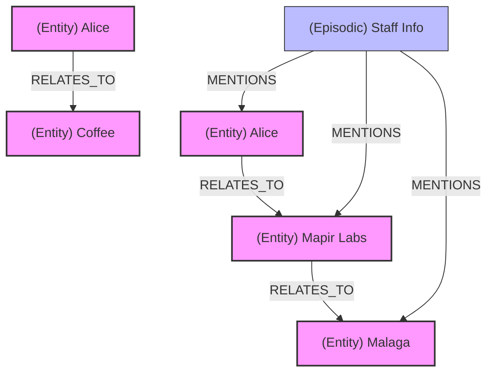

# Knowledge Graph Visualization (Mermaid)

```mermaid
graph TD
    n0["(Episodic) Staff Info"]
    style n0 fill:#bbf,stroke:#333,stroke-width:1px
    n1["(Entity) Alice"]
    style n1 fill:#f9f,stroke:#333,stroke-width:2px
    n2["(Entity) Mapir Labs"]
    style n2 fill:#f9f,stroke:#333,stroke-width:2px
    n3["(Entity) Malaga"]
    style n3 fill:#f9f,stroke:#333,stroke-width:2px
    n4["(Entity) Alice"]
    style n4 fill:#f9f,stroke:#333,stroke-width:2px
    n5["(Entity) Coffee"]
    style n5 fill:#f9f,stroke:#333,stroke-width:2px
    n0 -- "MENTIONS" --> n1
    n0 -- "MENTIONS" --> n2
    n0 -- "MENTIONS" --> n3
    n1 -- "RELATES_TO" --> n2
    n2 -- "RELATES_TO" --> n3
    n4 -- "RELATES_TO" --> n5

```
